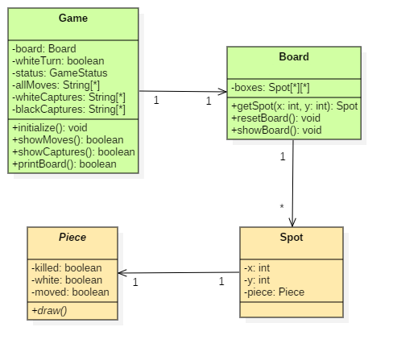
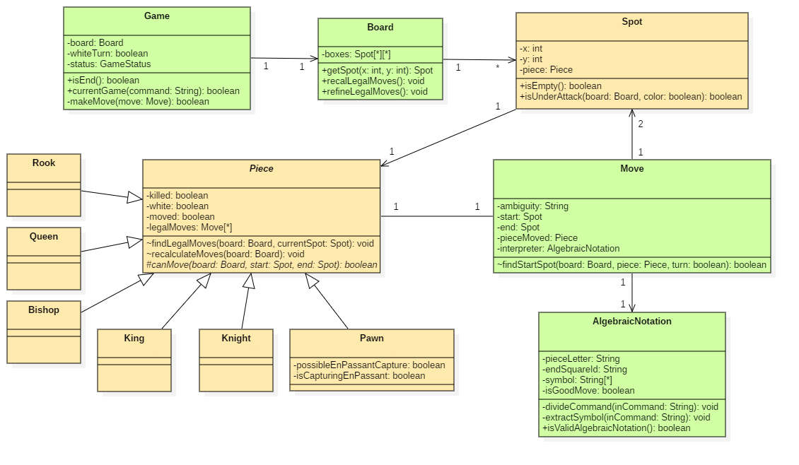

# INDICE
1. [Introduzione](#Introduzione)
2. [Modello di dominio](#Modello-di-dominio)
3. [Requisiti specifici](#Requisiti-specifici)
    - [Requisiti funzionali](#Requisiti-funzionali)
    - [Requisiti non funzionali](#Requisiti-non-funzionali)
4. [System Design](#System-Design)
    - [Stile architetturale adottato](#Stile-architetturale-adottato)
    - [Diagramma dei package](#Diagramma-dei-package)
    - [Commenti](#Commenti-SD)
5. [OO Design](#OO-Design)
    - [Diagrammi delle classi e diagrammi di sequenza](#Diagrammi-delle-classi-e-diagrammi-di-sequenza)
    - [Design pattern utilizzati](#Design-pattern-utilizzati)
    - [Commenti](#Commenti-OO)
6. [Riepilogo del test](#Riepilogo-del-test)
7. [Manuale utente](#Manuale-utente)
8. [Processo di sviluppo e organizzazione del lavoro](#Processo-di-sviluppo-e-organizzazione-del-lavoro)
9. [Analisi retrospettiva](#Analisi-retrospettiva)
    - [Soddisfazioni](#Soddisfazioni)
    - [Insoddisfazioni](#Insoddisfazioni)
    - [Cosa ci ha fatto impazzire](#Cosa-ci-ha-fatto-impazzire)


# Introduzione
   **SCACCHI** è una applicazione interattiva di gioco degli ***scacchi*** sviluppata su Java e giocabile tramite interfaccia a linea di comando.

   [***Il gioco degli scacchi***](https://it.wikipedia.org/wiki/Scacchi) è uno dei giochi più antichi, affascinanti e popolari al mondo.

   [***FIDE***](https://www.fide.com/) è il sito web della Federazione internazionale degli scacchi, la principale organizzazione mondiale del gioco degli scacchi, che organizza campionati mondiali e che regolamenta il gioco.

   Il nostro gioco è basato su una matrice 8x8 che rappresenta le 64 case di una scacchiera.
    

   L'applicazione permette di giocare seguendo la [notazione algebrica](https://it.wikipedia.org/wiki/Notazione_algebrica) abbreviata degli scacchi.

   L'esecuzione dell'applicazione è possibile attraverso linee di comando via [Docker](https://hub.docker.com/).

   L'interazione avviene attraverso un'interfaccia rappresentata su linea di comando, dove la ***scacchiera*** viene opportunamente disegnata, indicando anche lettere e numeri di colonna, per permettere all'utente di giocare agevolmente.

   **SCACCHI** è figlia del corso di INGEGNERIA DEL SOFTWARE tenuto dal [*Professore Filippo Lanubile*](http://www.di.uniba.it/~lanubile/) nell'Anno Accademico 2019-2020, dal gruppo ***wilkinson*** composto da: 
   
   - [Gianluca Laera](https://github.com/gian01pie)  
   - [Stefano Lozito](https://github.com/stefanolozito)  
   - [Vincenzo M.G. Martemucci](https://github.com/raimondoDiSangro)  
   - [Andrea Perruggini](https://github.com/Perru21)  
   - [Nicola Ragone](https://github.com/nicolara96)  
   - [Giuseppe Sancesario](https://github.com/Giuseppe199925)  
   - [Pierpaolo Ventrella](https://github.com/pventrella20)  
     <br>


   <br> <br>
   [Torna all'indice...](#Indice)

# Modello di dominio

<center>

</center>

<br> <br>
[Torna all'indice...](#Indice)

# Requisiti specifici

### Requisiti funzionali

_______________
#### ***>>>>> [SPRINT 1] user stories <<<<<***
_______________
#### 1.1) CREARE ELENCO COMANDI
  ***Scopo:*** visualizzare elenco dei comandi
  ##### CRITERI DI ACCETTAZIONE
  - eseguendo il comando  
  	[ ***>help*** ]  
  - il risultato è una lista di comandi (uno per riga)
  
  <center>
	
</center>

  > - **esempio comandi**:  
  > *>board*,  
  > *>import*,  
  > *>export*,  
  > *>quit*,  
  > *...*  
_______________
#### 1.2) INIZIARE UNA NUOVA PARTITA
  ***Scopo:*** permettere all'utente di interfacciarsi ad una partita
  ##### CRITERI DI ACCETTAZIONE
  - eseguendo il comando  
  	[ ***>play*** ]  
  - l'applicazione si predispone a ricevere la prima mossa di gioco
  
  <center>
	
</center>

  > - il sistema è in grado di ricevere altri comandi in questo stato, ad esempio  
  > *>mostra scacchiera*,  
  > *>annullare*,  
  > *...*
  > - è possibile iniziare una nuova partita anche a partita già in corso
_______________
#### 1.3) CHIUDERE IL GIOCO
  ***Scopo:*** permettere di uscire dalla partita in corso
  ##### CRITERI DI ACCETTAZIONE
  - eseguendo il comando  
  	[ ***>quit*** ]  
  - l'applicazione lascia il controllo al sistema operativo
  
  <center>
	
</center>

  > - (il sistema non accetta più altri comandi e termina)
  _______________
#### 1.4) MOSTRARE LA SCACCHIERA
  ***Scopo:*** permettere la visualizzazione a schermo (da CLI) della scacchiera nello stato attuale
  ##### CRITERI DI ACCETTAZIONE
  - eseguendo il comando  
  	[ ***>board*** ]  
  - l'applicazione stampa a video la posizione sulla scacchiera
  
  <center>
	
</center>

  > - ogni pezzo è visualizzato con posizione aggiornata all'ultima mossa inserita  
  > - i pezzi sono visualizzati in formato [*Unicode*](https://en.wikipedia.org/wiki/Chess_symbols_in_Unicode)  
  _______________
  #### 1.5) MOSTRARE MOSSE GIOCATE
  ***Scopo:*** permettere di visualizzare lo storico delle mosse giocate
  ##### CRITERI DI ACCETTAZIONE
  - eseguendo il comando  
  	[ ***>moves***]  
  - l'applicazione mostra la storia delle mosse compiute fino a quel momento
  
  <center>
	
</center>

  > - le mosse sono visualizzate in notazione algebrica abbreviata in italiano
_______________
#### 1.6) VISUALIZZARE LE CATTURE
  ***Scopo:*** permettere di visualizzare a video i pezzi catturati nel corso della partita
  ##### CRITERI DI ACCETTAZIONE
  - eseguendo il comando  
  	[***>captures***]  
  - l'applicazione mostra tutte le catture della partita in corso fino a qual momento
  
  <center>
	
</center>

  > - mostrare le catture del Bianco e del Nero in caratteri Unicode
_______________
#### NOTE SULLA NOTAZIONE ALGEBRICA ABBREVIATA
  - la mossa deve essere scritta come  
  	[**nome pezzo**] + [**casella di arrivo sulla scacchiera**] + [**simbolo speciale**]  
  - dove:    
  	- [***nome pezzo***] è una lettera riportata nella tabella qui sotto (nel caso dei pedoni non viene utilizzata nessuna lettera)  
  	- [***casella di arrivo sulla scacchiera***] è un combinazione lettera+numero (id colonna + id riga) [>*chessboard*](https://upload.wikimedia.org/wikipedia/commons/5/51/AlgebraicNotationOnChessboard.png)  
  	- [***simbolo speciale***] è uno dei simbolo utilizzati per evidenziare il verificarsi di un evento particolare (*scacco*, *scacco matto*, *promozione*, *cattura*, *...*)  
  
| `nome pezzo` | Re  | Donna | Torre | Alfiere | Cavallo |
|--------------|-----|-------|-------|---------|---------|
| simbolo      | ♔ ♚ | ♕ ♛ | ♖ ♜ | ♗ ♝ | ♘ ♞ |
| lettera ITA  | R   | D     | T     | A       | C       |
| lettera ENG  | K   | Q     | R     | B       | N       |

| `eventi` | scacco | scacco doppio | cattura | arrocco corto | arrocco lungo | presa en passant | scacco matto |
|----------|--------|---------------|---------|---------------|---------------|------------------|:------------:|
| simbolo  | +      | ++            | x       | 0-0           | 0-0-0         | e.p.             | #            |
_______________
#### 1.7) MUOVERE UN PEDONE
  ***Scopo:*** permettere il movimento del pezzo *pedone* sulla scacchiera
  ##### CRITERI DI ACCETTAZIONE
- scrivendo il comando in notazione algebrica abbreviata degli scacchi in italiano  
  	- la mossa deve essere legale
  	- se si tenta una mossa non valida viene visualizzato un messaggio *mossa illegale* e l'applicazione rimane in attesa di una mossa valida  
	- l'eventuale cambio di colonna derivante la cattura del pedone deve essere preceduto dalla lettera corrispondente alla colonna di partenza (*es. exf2*)

<center>
	
</center>

 > - ***movimento del pedone***
 >    - il pedone può muoversi solo di una casa in avanti, tolta la possibilità di avanzare di due case solo dalla posizione iniziale   
 >    - può catturare i pezzi avversari che si trovano in una delle due caselle oblique a lui adiacenti (a eccezione della presa [en passant](https://lh3.googleusercontent.com/proxy/HdFbE8mPf0x5pYtg7hqGuf2lYdxeZZWUVjgbkjy3ofzEqL_EHpY7zvgWleUN-oAH7ZcafKkFByJezfbaukukb97P0wPq7pWUZo0b0xoA2jBXSSWRv4vT6SBDRgf1UsJOzmRAKghF)): è quindi l'unico pezzo che mangia in modo diverso dal proprio normale movimento  
 >    - se un pedone riesce a raggiungere il lato opposto della scacchiera, il proprietario del pedone lo deve promuovere sostituendolo con un qualsiasi altro pezzo a sua scelta (purché dello stesso colore, e che non sia il re)
_______________
#### ***>>>>> [SPRINT 2] user stories <<<<<***
_______________

#### 2.1) MUOVERE UN CAVALLO
  ***Scopo:*** permettere il movimento del pezzo *cavallo* sulla scacchiera
  ##### CRITERI DI ACCETTAZIONE
  - scrivendo il comando in notazione algebrica abbreviata degli scacchi in italiano  
  	- la mossa deve essere legale
  	- se si tenta una mossa non valida viene visualizzato un messaggio *mossa illegale* e l'applicazione rimane in attesa di una mossa valida  
  	- la mossa deve essere preceduta da una 'C' 
  
<center>
	
</center>

 > - ***movimento del cavallo***
 >    - il *Cavallo* si muove e cattura alternativamente su case bianche e case nere
 >    - ogni mossa può essere descritta come due passi in orizzontale (verticale) seguito da un passo in verticale (orizzontale), in modo che il tragitto percorso formi idealmente una "L"
 >    - il *Cavallo* è l'unico pezzo presente sulla scacchiera a cui è permesso "saltare" i pezzi, sia alleati, sia avversari 
 >    - l'unico dietro i pedoni che all'inizio può essere mosso senza bisogno di spostare prima questi ultimi
 _______________
#### 2.2) MUOVERE UN ALFIERE
  ***Scopo:*** permettere il movimento del pezzo *alfiere* sulla scacchiera
  ##### CRITERI DI ACCETTAZIONE
  - scrivendo il comando in notazione algebrica abbreviata degli scacchi in italiano  
  	- la mossa deve essere legale
  	- se si tenta una mossa non valida viene visualizzato un messaggio *mossa illegale* e l'applicazione rimane in attesa di una mossa valida  
  	- la mossa deve essere preceduta da una 'A' 
  
<center>
	
</center>

 > - ***movimento dell'alfiere***
 >    - l'*Alfiere* si muove diagonalmente per il numero di caselle libere che ha a disposizione
 >    - l'*Alfiere* è l'unico pezzo che non può cambiare il colore delle case su cui si appoggia nei suoi movimenti in diagonale
 _______________
#### 2.3) MUOVERE UNA TORRE
  ***Scopo:*** permettere il movimento del pezzo *torre* sulla scacchiera
  ##### CRITERI DI ACCETTAZIONE
  - scrivendo il comando in notazione algebrica abbreviata degli scacchi in italiano  
  	- la mossa deve essere legale
  	- se si tenta una mossa non valida viene visualizzato un messaggio *mossa illegale* e l'applicazione rimane in attesa di una mossa valida  
  	- la mossa deve essere preceduta da una 'T' 
  
<center>
	
</center>

 > - ***movimento della torre***
 >    - la *Torre* si muove sia orizzontalmente sia verticalmente per il numero di caselle libere che ha a disposizione
 >    - in congiunzione con il *Re*, può eseguire la mossa dell'arrocco
 _______________
#### 2.4) MUOVERE LA DONNA
 ***Scopo:*** permettere il movimento del pezzo *donna* sulla scacchiera
  ##### CRITERI DI ACCETTAZIONE
  - scrivendo il comando in notazione algebrica abbreviata degli scacchi in italiano  
  	- la mossa deve essere legale
  	- se si tenta una mossa non valida viene visualizzato un messaggio *mossa illegale* e l'applicazione rimane in attesa di una mossa valida  
  	- la mossa deve essere preceduta da una 'D' 
  
<center>
	
</center>

 > - ***movimento della donna***
 >    - la *Donna* si può muovere in linee rette verticalmente, orizzontalmente o in diagonale per il numero di case non occupate che trova
 >    - combina dunque le mosse della torre e dell'alfiere
_______________
#### 2.5) MUOVERE IL RE
 ***Scopo:*** permettere il movimento del pezzo *re* sulla scacchiera
 ##### CRITERI DI ACCETTAZIONE
 - scrivendo il comando in notazione algebrica abbreviata degli scacchi in italiano  
 	- la mossa deve essere legale
  	- se si tenta una mossa non valida viene visualizzato un messaggio *mossa illegale* e l'applicazione rimane in attesa di una mossa valida  
  	- la mossa deve essere preceduta da una 'R' 
  	- il *Re* non può muoversi in case minacciate da pezzi avversari 
  	- il *Re* può catturare pezzi avversari
	- nessun pezzo amico deve permettere di "scoprire" il *Re* con la propria mossa
  
<center>
	
</center>

 > - ***movimento del re***
 >    - il *Re* può muoversi di una casa alla volta in qualsiasi direzione (verticale, orizzontale o diagonale) a condizione che la casa di arrivo non sia minacciata da un pezzo avversario
 >    - in congiunzione con la *Torre*, può eseguire la mossa dell'arrocco
_______________
 #### 2.6) EFFETTUARE UN ARROCCO CORTO
  ***Scopo:*** permettere l'esecuzione di un arrocco corto
  ##### CRITERI DI ACCETTAZIONE
  - scrivendo il comando '0-0' in notazione algebrica abbreviata degli scacchi
  	- il giocatore non deve aver mai mosso il *Re*
  	- il giocatore non deve aver mai mosso la *Torre* coinvolta nell'arrocco corto (deve quindi essere in un angolo di destra della scacchiera) 
  	- non ci devono essere pezzi tra il *Re* e la *Torre* coinvolta, né amici né avversari 
  	- il *Re* non deve essere minacciato 
  	- il *Re*, durante il movimento dell'arrocco, non deve attraversare caselle in cui si troverebbe sotto *scacco* 
  
<center>
	
</center>

<center>
	
</center>

 > - ***definizione di arrocco corto***
 >    - l'arrocco è effettuato sull'ala di *Re* (sulla destra della scacchiera)
 >    - [***per il Bianco***] il *Re* da **e1** muove in **g1**, la *Torre* da **h1** muove in **f1**
 >    - [***per il Nero***] il *Re* da **e8** muove in **g8**, la *Torre* da **h8** muove in **f8**
_______________
#### 2.7) EFFETTUARE UN ARROCCO LUNGO
  ***Scopo:*** permettere l'esecuzione di un arrocco lungo
  ##### CRITERI DI ACCETTAZIONE
  - scrivendo il comando '0-0-0' in notazione algebrica abbreviata degli scacchi
  	- il giocatore non deve aver mai mosso il *Re*
  	- il giocatore non deve aver mai mosso la *Torre* coinvolta nell'arrocco lungo (deve quindi essere in un angolo di sinistra della scacchiera) 
  	- non ci devono essere pezzi tra il *Re* e la *Torre* coinvolta, né amici né avversari 
  	- il *Re* non deve essere minacciato 
  	- il *Re*, durante il movimento dell'arrocco, non deve attraversare caselle in cui si troverebbe sotto *scacco* 
  
<center>
	
</center>

<center>
	
</center>

 > - ***definizione di arrocco lungo***
 >    - l'arrocco è effettuato sull'ala di *Donna* (sulla sinistra della scacchiera)
 >    - [***per il Bianco***] il *Re* da **e1** muove in **c1**, la *Torre* da **a1** muove in **d1**
 >    - [***per il Nero***] il *Re* da **e8** muove in **c8**, la *Torre* da **a8** muove in **d8**
_______________
### Requisiti non funzionali
_______________

L'applicazione Scacchi viene eseguita tramite macchina virtuale Linux grazie alla containerizzazione docker. Pertanto dovrà essere eseguito su sistemi operativi e macchine che supportano la virtualizzazione OS.

L'utente deve conoscere la [notazione algebrica](https://it.wikipedia.org/wiki/Notazione_algebrica) "abbreviata" italiana per poter giocare in quanto l'applicazione è prettamente testuale.

Il gioco può essere eseguito sui sistemi operativi più comuni ([Linux](https://it.wikipedia.org/wiki/Linux), [macOS](https://it.wikipedia.org/wiki/MacOS), [Microsoft Windows](https://it.wikipedia.org/wiki/Microsoft_Windows)) su [shell](https://it.wikipedia.org/wiki/Shell_%28informatica%29)  apposite:

***Linux***
 - Terminal incluso nell'OS;

***macOS***
 - Terminale incluso nell'OS;

***Microsoft Windows***
 - [Windows Terminal](https://www.microsoft.com/it-it/p/windows-terminal/9n0dx20hk701?activetab=pivot:overviewtab)
 - [Git Bash for Windows](https://git-scm.com/download/win)

###### N.B.: l'utente dovrà installare [Docker](https://www.docker.com/products/docker-desktop)  a prescindere dal sistema operativo o shell utilizzati.
L’interfaccia utente è stata implementata con caratteri UTF-8. In questa codifica, ci sono oltre i caratteri di uso comune (lettere) anche i caratteri [*Unicode*](https://en.wikipedia.org/wiki/Chess_symbols_in_Unicode) per visualizzare la stampa della scacchiera (linee divisorie delle case e pezzi della scacchiera).
Vengono utilizzati anche codici [ANSI](https://www.lihaoyi.com/post/BuildyourownCommandLinewithANSIescapecodes.html#colors) per colorare le case della scacchiera per rendere più visibile il gioco degli scacchi.
_______________
#### ***>>>>> Requisiti minimi <<<<<***
_______________
***requisiti minimi per Linux*** 
 - Ubuntu versione 16.04 (LTS) 64Bit o successiva.

***requisiti minimi per macOS*** 
- macOS versione 10.13 o successiva:  High Sierra (10.13), Mojave (10.14) o Catalina (10.15);
- L'hardware Mac deve essere di un modello 2010 o più recente che sia compatibile con la tecnologia di virtualizzazione.

***requisiti minimi per Windows*** 
- Windows 10 Pro, Enterprise, Education 64Bit che supporta [Hyper-V](https://docs.microsoft.com/it-it/virtualization/hyper-v-on-windows/quick-start/enable-hyper-v);
- Processore a 64 bit con SLAT (Second Level Address Translation, Conversione indirizzi di secondo livello).
- Supporto della CPU per estensioni modalità di monitoraggio macchina virtuale (VT-c nelle CPU Intel).
- Almeno 4 GB di memoria RAM.

<br><br>
[Torna all'indice...](#Indice)

# System Design

### Stile architetturale adottato
Lo stile architetturale adottato segue il pattern del [Model-view-controller](https://en.wikipedia.org/wiki/Model%E2%80%93view%E2%80%93controller).

Tale modello di architettura è molto diffuso nello sviluppo di sistemi software, nello specifico nell'ambito della programmazione orientata agli oggetti. Questo schema consente di realizzare la separazione dei 
concetti, dunque porre una netta divisione tra la logica di presentazione dei dati (*View*) e la logica business (*Model*).

Sebbene **SCACCHI** non segua pedissequamente i principi del pattern **MVC**, è, ad ogni modo, lo stile che meglio rappresenta il modello da noi adottato, ne consegue che i tre componenti principali del suddetto stile, applicati al nostro progetto, sono:

- **Model :** E' il fulcro del gioco. Ne fanno parte tutte quelle classi che contengono in se la logica di gioco, come la classe Move che gestisce il movimento di un qualunque pezzo, o la classe AlgebraicNotation che interpreta in notazione algebrica un comando ricevuto dal controller.
- **Controller :** Il controller collega il modello, la vista e l'interazione dell'utente, di fatto fa da collante tra le classi.
Esso sfrutta e orchestra le classi di gioco, a seconda della situazione può: impostare una nuova scacchiera, ricevere l'input dell'utente, convalidarlo e quindi aggiornare la Board di conseguenza. Il controller inoltre può interrompere una partita e/o iniziarne una nuova.
- **View :** Come precisato in precedenza, la nostra applicazione software si distingue dall'MVC "puro" anche per via della mancanza di una vera e propria GUI ([Graphical user interface](https://en.wikipedia.org/wiki/Graphical_user_interface)), essendo un'applicazione a riga di comando. Ad ogni modo è comunque possibile visualizzare la scacchiera, le mosse e le catture effettuate, tramite immissione di specifici comandi.

<br>
  
<br>

### Diagramma dei package

<br>
  
<br>

### <a name="Commenti-SD"></a>Commenti delle decisioni prese
- L'applicazione è stata organizzata in due package per permetterne futuri sviluppi ai quali il gioco degli scacchi ben si presta: sono realizzabili diverse *features*, dall'introduzione di **giocatori personalizzabili**, allo **store delle partite**, al calcolo di **ELO** di un giocatore o alla possibilità di giocare **in rete**.

<br><br>
[Torna all'indice...](#Indice)

# OO Design
### <a name="Diagrammi-delle-classi-e-diagrammi-di-sequenza"></a> Diagrammi delle classi e diagrammi di sequenza

* ***Diagramma delle classi*** per le User Stories che interessano i **comandi speciali** da inviare all'applicazione

<center>
	
</center>

<br> <br>

... ***Diagramma di sequenza*** relativo alla User Story del **comando 'play'** ...

<center>
	
</center>

<br> <br>

... ***Diagramma delle classi*** per le User Stories che interessano il **movimento di un pezzo** sulla scacchiera ...

<center>
	
</center>

<br> <br>

... ***Diagramma di sequenza*** relativo alle User Stories del **movimento di un pezzo** sulla scacchiera ...

<center>
	
</center>

<br> <br>

... ***Diagramma delle classi*** per le User Stories che interessano l'**arrocco** corto e lungo ...

<center>
	
</center>

<br> <br>

... ***Diagramma di sequenza*** relativo alle User Stories dell'**arrocco** corto e lungo.

<center>
	
</center>

<br> <br>

<a name="Design-pattern-utilizzati"></a>

### Design patterns
Il progetto da noi sviluppato non è ascrivibile ad un particolare *Design Pattern*. 
Abbiamo però vagliato diverse opzioni di *pattern*, da cui abbiamo preso spunto e che ci hanno aiutato a realizzare alcune parti implementative:
<br>
- **Prototype pattern:** la configurazione iniziale della scacchiera è un ottimo esempio di prototipo, da poter istanziare e clonare ad ogni nuovo inizio partita.
<br><br>
- **Abstract Factory pattern:** abbiamo scartato l'introdurre una ideale *PieceFactory* per la chiamata singola o multipla agli oggetti sulla scacchiera a seconda dei parametri di input, invece la specializzazione di un pezzo è risultata molto comoda nell'implementazione, permettendoci in modo semplice ed intuitivo di differenziare i vari pezzi degli scacchi ma lasciandone intatta la logica di base (un pezzo differisce da un altro solo nel comportamento sulla scacchiera).
<br><br>
- **Strategy pattern:** piuttosto che creare una classe astratta generica estendibile da quelle specifiche implementandone il proprio movimento caratteristico, abbiamo delegato alla classe scacchiera la determinazione della posizione reciproca di due case (differente per ogni tipo di pezzo), per poi utilizzarla nel calcolo delle mosse legali.

<a name="Commenti-OO"></a>

### Commenti
- Analizzando le varie **User Stories** e la relativa realizzazione a livello di *OO Design*, abbiamo riscontrato che per la maggior parte di esse le operazioni ed i pattern di progetto seguiti permettessero una divisione delle stesse in **3 macro-categorie**:
	- User Stories sui **comandi speciali** da utilizzare in partita (*>play, >moves, >captures, >board, >help*);
	- User Stories sul **movimento dei pezzi** sulla scacchiera (*Pedone, Alfiere, Cavallo, Torre, Regina e Re*);
	- User Stories sull'effettuare un **arrocco** (*corto o lungo*);
- La realizzazione dei **diagrammi delle Classi** e dei **diagrammi di Sequenza** ha dunque seguito questa classificazione effettuata a priori.

<br><br>
[Torna all'indice...](#Indice)

# Riepilogo del test

<br>


### <a name="Commenti-TEST"></a>Commenti delle decisioni prese
* Abbiamo preso la decisione di non testare i metodi di stampa (per visualizzare le catture, la scacchiera o le mosse effettuate) poichè ritenuti di poco interesse e di funzionalità facilmente testabile "visivamente". In particolare questi ultimi sono dislocati all'interno delle classi *Board.java* e *Game.java*, inoltre le singole classi dei pezzi (derivate dalla classe astratta *Piece.java*) contengono un metodo che ritorna il carattere Unicode corrispondente, anch'esso non testato per i motivi di cui sopra.

<br><br>
[Torna all'indice...](#Indice)

# Manuale utente

Per avviare l'applicazione bisogna:

 1. Lanciare il comando per scaricare l'immagine docker più recente
```
    docker pull docker.pkg.github.com/softeng1920-inf-uniba/docker_1920/wilkinson:latest
```
 2. Lanciare il comando per avviare l'immagine docker in locale
```
    docker run -it --rm docker.pkg.github.com/softeng1920-inf-uniba/docker_1920/wilkinson:latest
```
   per utilizzare Scacchi sul proprio terminale, occorre scaricare l'immagine Docker dell'ultima build, ed in seguito, avviarla.  
###### N.B.: se l'utente sta utilizzando Git Bash for Windows, deve aggiungere il prefisso "winpty" prima dell'intero comando
###### N.B.: Per eseguire l'applicazione sui terminali Windows e terminale macOS, a prescindere dalla shell selezionata, deve essere lanciata prima l'applicazione docker e caricati i container Linux.
<br><br>
* L'applicazione consente di giocare una partita di **scacchi** da un singolo terminale, condividendo il metodo di input con un altro giocatore, o svolgere una partita in solitaria.
<br><br>
* All'interno del gioco sono presenti diversi comandi utili all'utente(i) al fine di rendere migliore l'esperienza di gioco; alcuni di essi sono utilizzabili correttamente solo a partita in corso.
<br><br>
* il comando `play` consente di iniziare una nuova partita e offre queste funzionalità:  
   - la possibilità di introdurre mosse in `notazione algebrica abbreviata` per proseguire con la partita appena iniziata  
   - `board`: mostra la scacchiera con la configurazione attuale dei pezzi presenti sulla scacchiera  
   - `moves`: mostra in notazione algebrica tutti i movimenti eseguiti fino al lancio del comando  
   - `captures`: mostra tutte le catture avvenute fino al momento in cui viene eseguito il comando  
   - `help`: mostra i comandi disponibili per l'applicazione  
   - `play`: a partita in corso, consente di interrompere la partita corrente, e previa conferma, iniziarne una nuova  
   - `quit`: permette all'utente di abbandonare la partita in corso, previa conferma  

<br> <br>
[Torna all'indice...](#Indice)

# Processo di sviluppo e organizzazione del lavoro
Il processo di sviluppo di **SCACCHI** ha seguito un approccio di tipo [***SCRUM***](https://it.wikipedia.org/wiki/Scrum_%28informatica%29), con alcune modifiche.
Lo sviluppo dell'applicazione ha previsto tre sprint di diversa durata. 
  - Il Professore ha ricoperto, a seconda delle necessità e per fini didattici, il ruolo del **Product Owner**, assumendosi la responsabilità della gestione del Product Backlog, e quello dello **Scrum Master**, fornendo aiuto a capire le regole, la teoria ed i valori di Scrum. 
  Prima dell'inizio di ogni sprint, ci sono stati comunicati  gli obiettivi da realizzare, e le loro priorità, attraverso i concetti di *User Stories* e *Definition of Done*.
  Sono state previste delle board per ogni sprint, ed una board generale di **Product Backlog** in cui è stato elencato tutto il lavoro da fare in futuro, sotto forma di *User Story*.
  Le priorità sono quindi state definite dal Product Owner e le storie associate hanno fatto parte della *Sprint Board* di ogni sprint.
  <br> <br>
  - L'obiettivo del team da raggiungere alla fine di ogni sprint, detto **Sprint Goal**, è stato dettato, dalla *Definition of Done*, una lista contenente le user story da portare a termine, per considerare lo sprint compiuto. 
  <br> <br>
  - Ogni *Sprint board* è stata rappresentata tramite una board virtuale su [**GitHub**](https://github.com/), organizzata in stile [*Kanban*](https://it.wikipedia.org/wiki/Kanban) secondo questo critetrio:   
  <br> <br>
    - **TO DO**, compiti non ancora svolti
    - **IN PROGRESS**, compiti in svolgimento
    - **REVIEW**, compiti in attesa di *build* di *GitHub Actions* e revisione di almeno un componente del team
    - **READY**, compiti svolti ma in attesa di revisione da parte dei Professori
    - **DONE**, compiti svolti che non necessitano di ulteriore revisione
  <br> <br>
  - Come gruppo ci siamo auto-organizzati ed abbiamo gestito in autonomia la suddivisione del lavoro. I vari componenti hanno affrontato le varie problematiche da fronteggiare con flessibilità e sempre con responsabilità nei confronti del lavoro da svolgere e nei confronti degli altri componenti del gruppo.
  <br> <br>
  - La gestione dello sviluppo è stata coordinata attraverso il **GitHub Flow**: <br>
    il lavoro da svolgere è stato rappresentato da diversi *Issue*, ogni issue è stato assegnato ad almeno un membro del gruppo, ed è stato associato ad un *branch* sul quale sviluppare il software necessario.
    Alla fine dello sviluppo necessario per un *Issue*, il contenuto del *branch* è stato testato e sottoposto alla review degli altri componenti del gruppo tramite una *pull request*. Solo quando il team ha approvato il software associato all'issue in pull request, il branch è stato inserito all'interno del branch *master* attraverso un'operazione di *merge*, previa risoluzione di eventuali conflitti.
  <br><br>
  - Per dividerci i diversi **task** abbiamo utilizzato una *Project Board* parallela, contenente gli *issue* identificati dal gruppo (oltre le *user stories*), contestualmente all'efficace meccanismo di aggiunta delle *note con spunta* messo a disposizione direttamente da GitHub, che ci ha permesso una consultazione in tempo reale dei compiti da svolgere.
  <br> <br>
  - I **Daily Meeting** sono avvenuti quotidianamente su [**Microsoft Teams**](https://www.microsoft.com/it-it/microsoft-365/microsoft-teams/free?market=it), per via dell'impossibilità di incontrarsi di persona, dettata dalla diffusione del virus SARS-CoV-2. Anche alcune sessioni di sviluppo sono avvenute tramite Microsoft Teams, che è risultato molto utile grazie agli strumenti di condivisione dello schermo, e alla [**Whiteboard**](https://www.microsoft.com/it-it/microsoft-365/microsoft-whiteboard/digital-whiteboard-app) associata.

<br> <br>
[Torna all'indice...](#Indice)
# Analisi retrospettiva
- ### Soddisfazioni
    La comunicazione e la puntualità dei membri del gruppo è stata senza dubbio un segnale di maturità e motivazione. I contatti tra di noi sono stati molto costruttivi, gli scambi di idee e i consigli hanno permesso ad ogni membro del team di imparare qualcosa da un altro membro. Questo ha permesso, durante l'arco della durata del progetto, a ciascun elemento del team di impare qualcosa di nuovo ed utile, oltre che a migliorare l'uso delle metodologie di sviluppo AGILE.
    <br> <br>
Gli strumenti [**GitHub**](https://github.com/) e [**Git**](https://git-scm.com/), inzialmente visti con un certo scetticismo, sono diventati imprescindibili per portare avanti lo sviluppo in team.
    <br> <br>
    Il Daily Scrum Meeting è sempre avvenuto su [**Microsoft Teams**](https://www.microsoft.com/it-it/microsoft-365/microsoft-teams/free?market=it) in virtù della ben nota problematica del nuovo Coronavirus in corso. Il tool di Microsoft si è rivelato molto utile grazie alle sue diverse features.
    <br> <br>
Grazie al progetto abbiamo avuto la possibiltà di ricevere nuovi stimoli e di metterci in gioco in un ambito sconosciuto ad ognuno di noi. Ognuno ha dimostato di essere indispensabile al raggiungimento dell'obiettivo finale, ma allo stesso tempo di avere una visione aperta nel ricevere consigli da altri membri del team quando si presentavano difficoltà; quindi crediamo che il progetto ci abbia fatto anche crescere a livello personale, avvicinandoci un po' di più a ciò che sarà il nostro futuro in ambito lavorativo.
	
- ### Insoddisfazioni
    In alcuni casi, oltre al Daily Scrum Meeting, è stato necessario "incontrarci" per poter dialogare e discutere sulle problematiche che via via si sono presentate. Quindi in aggiunta al metodo [**SCRUM**](https://it.wikipedia.org/wiki/Scrum_%28informatica%29) classico, è stato necessario aggiungere delle sessioni di vero e proprio lavoro congiunto che potesse risolvere nuovi problemi, dovuti principalmente al fatto che la maggior parte dei membri del team abbiano dovuto studiare java "in corso d'opera". Queste sessioni, tuttavia, si sono via via ridotte in quanto ognuno, grazie all'esperienza accumulata durante le sessioni precedenti, è stato in grado di procedere in autonomia, sempre secondo il [**GitHub flow**](https://guides.github.com/introduction/flow/).
     <br> <br>
    Un'altra insoddisfazione è stata quella di non avere mai avuto l'occasione di *incontrarci di persona* durante tutta la durata del progetto, magari dopo le lezioni universitarie in aula. Pur avendo avuto a disposizione diverse tecnologie e tante opportunità di essere sempre in contatto, l'assenza di veri e propri faccia a faccia fra i membri del gruppo ha reso a tratti estranianti le relazioni interpersonali del gruppo. 
     <br> <br>
     Dato l'elevato numero di membri del Team, spesso è risultato dispendioso (in termini di tempo) riuscire a suddividere efficacemente il lavoro da svolgere al fine di ridurre al minimo i *conflitti*, contestualmente sia sui task da portare a termine che quelli sulle **pull request** che avrebbero generato.

- ### Cosa ci ha fatto impazzire
	Lo scoglio più grande dal punto di vista implementativo è stato senza dubbio quello della cattura _en passant_ del pedone, a tal punto che nel gruppo pronunciare questo tipo di cattura è diventato un vero e proprio **tabù**: la cattura in questione ha portato ad un elevato numero di situazioni particolari da analizzare e da risolvere, non senza episodi di apparente risoluzione di un problema e di riscontro immediato del successivo.
    <br><br>
    Si è rivelato necessario, durante il tempo decorso dallo Sprint1 allo Sprint2, una revisione totale del modello di calcolo delle mosse legali dei pezzi, dovendolo estendere a tutti i pezzi sulla scacchiera, che ha un po' rimesso in discussione tutto il lavoro svolto fino a quel momento.

<br> <br>
[Torna all'indice...](#Indice)
